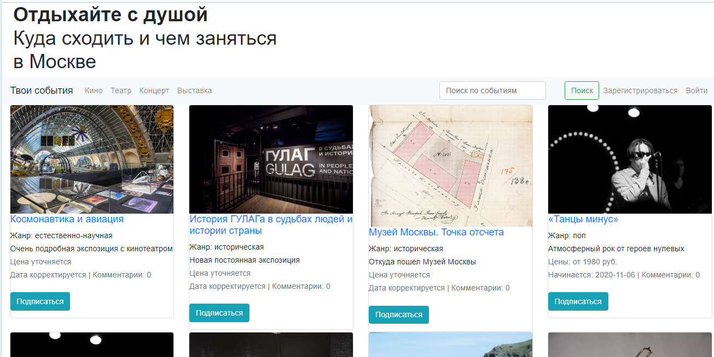

# events_alert_app

Have you ever wanted to go to Python Meetup or some conferencies, but realized it was last week? Maybe there was a free concerts in your area on data science or big data and you missed out because you forgot to check.

You can customize the system to work the way you want, and maybe even allow other people to make their own alerts by making this a website. Try it and you will keep in touch with your most favorite events.



## Installation

Clone this repository https://github.com/imaevam/events_alert_app.git

Create a virtual environment (use virtualenv) and activate it.

Then in a virtual environment do:

```pip install -r requirements.txt```

You can start the app from the terminal by using this script: 
Linux and Mac: ```export FLASK_APP=webapp && export FLASK_ENV=development && flask run ```

Windows: ```set FLASK_APP=webapp && set FLASK_ENV=development && set FLASK_DEBUG=1 && flask run```

Go to http://127.0.0.1:5000
